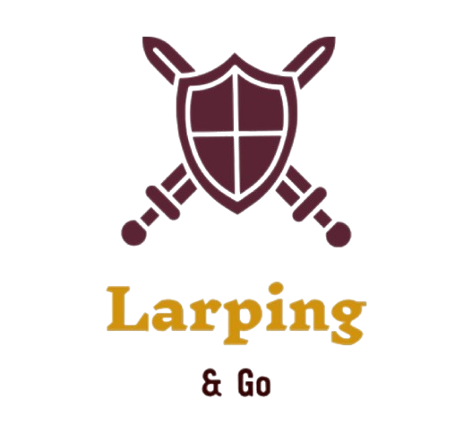

<h1 align="center" style="font-weight: bold;">Backend de</h1>

  

Este repositorio contiene toda la documentación oficial del Backend del proyecto **Larping & Go**, una plataforma colaborativa y social para comunidades de rol en vivo (LARP). Esta guía central proporciona acceso organizado a todos los documentos técnicos y funcionales.
 

Mira ahora el [**Índice General de Documentación**](#📚-índice-general-de-documentación).

---

## 🎯 ¿Qué es Larping & Go?

**Larping & Go** es una plataforma web moderna diseñada específicamente para cubrir las necesidades de jugadores, organizadores y comunidades enteras dentro del mundo del rol en vivo (Live Action Role-Playing - LARP). Nace de la observación directa de problemáticas comunes en comunidades LARP actuales: falta de centralización, comunicación dispersa, dificultad en la gestión de eventos, y carencia de herramientas digitales específicas.

Esta plataforma busca ser un **punto de encuentro**, de organización y de expresión para jugadores de rol en vivo, ofreciendo un sistema modular y altamente personalizable, adaptado a diferentes formas de juego, reglas y escalas de comunidad.

---

## 💡 ¿Por qué se crea?

**Larping & Go** surge por la necesidad de cubrir una carencia real en el entorno LARP hispanohablante y global. Si bien existen herramientas de mensajería y gestión dispersas, ninguna ofrecía una experiencia integrada orientada a este tipo de actividad. Se busca:

* Unificar gestión de personajes, eventos y hermandades.
* Potenciar la narrativa compartida y la inmersión digital.
* Facilitar la visibilidad de comunidades y eventos.
* Promover el juego continuo y el desarrollo de crónicas.
* Integrar funcionalidades modernas (WebSocket, adjuntos, cron, multimedia...).
* Impulsar con esto la comunidad larp, facilitando a novatos y veteranos este gran hobby.

---

## 🧩 ¿Qué ofrece?

**Larping & Go** proporciona un amplio abanico de funcionalidades interconectadas:

* Gestión de cuenta y perfil vinculado a personaje activo.
* Gestión y creación de personajes larp.
* Creación y administración de hermandades con roles jerárquicos.
* Tablones de anuncios y encuestas internas.
* Calendario de eventos internos y globales con asistentes.
* Sistema de mensajería real con soporte WebSocket, lectura y adjuntos.
* Galería multimedia de eventos, categorías y localización.
* Sistema de permisos y moderación.
* Soporte para múltiples personajes por usuario.
* Diseño modular, limpio y extensible.

Además, ya está prevista una **expansión futura** con crónicas, gamificación, muros públicos, explorador global de contenido, insignias, clasificación de hermandades y muchas más funcionalidades detalladas en el documento de futuras extensiones.

---

# 📚 Índice General de Documentación

### 🧠 Conceptos Generales

* [`ARQUITECTURA.md`](docs/ARQUITECTURA.md) → Diseño general, organización por microdominios y patrones aplicados.
* [`DATABASE-DESING.md`](docs/DATABASE-DESING.md) → Estructura lógica de tablas y relaciones.
* [`DATABASE-CONFIG.md`](docs/DATABASE-CONFIG.md) → Configuración técnica y estrategias de migración de base de datos.

### 🔐 Autenticación y Usuarios

* [`AUTH.md`](docs/AUTH.md) → Registro, login, JWT, recuperación de contraseña, permisos.
* [`USER.md`](docs/USER.md) → Gestión del perfil, personaje activo, avatar, visibilidad pública.

### 🧝‍♂️ Personajes y Hermandades

* [`CHARACTER.md`](docs/CHARACTER.md) → Modelo de personajes, propiedades personalizadas, validaciones.
* [`GUILD.md`](docs/GUILD.md) → Información general sobre hermandades, flujo de creación y diseño.
* [`GUILD-ROLES.md`](docs/GUILD-ROLES.md) → Sistema jerárquico de roles internos.
* [`GUILD-MEMBERSHIPS.md`](docs/GUILD-MEMBERSHIPS.md) → Flujos de membresía, invitaciones, kicks y solicitudes.
* [`GUILD-ANNOUNCEMENTS.md`](docs/GUILD-ANNOUNCEMENTS.md) → Tablón interno, encuestas, votos y resultados.
* [`GUILD-INTERNAL-EVENTS.md`](docs/GUILD-INTERNAL-EVENTS.md) → Entrenamientos, reuniones y calendario privado.

### 💬 Comunicación

* [`CHAT.md`](docs/CHAT.md) → Canales directos, de hermandad, subcanales, mensajes, lectura, adjuntos y WebSocket.

### 🌍 Eventos Globales y Noticias

* [`GLOBAL-EVENTS.md`](docs/GLOBAL-EVENTS.md) → Diseño de eventos públicos, asistentes, categorías, medios.

### 🧪 Funcionalidades futuras y visión extendida

* [`FUTURAS-FUNCIONALIDADES.md`](docs/FUTURAS-FUNCIONALIDADES.md) → Explorador, perfil público, gamificación, moderación, crónicas y más.

### 🧰 Guías del proyecto

* [`INSTALACION-LOCAL.md`](docs/INSTALACION-LOCAL.md) → Clonado del proyecto, instalación, entorno local.
* [`GUIA-CONTRIBUCION.md`](docs/GUIA-CONTRIBUCION.md) → Buenas prácticas, estructura de carpetas, commits y colaboración.
* [`LICENCIA.md`](docs/LICENCIA.md) → Condiciones de uso, derechos del autor, limitaciones y permisos.

---

## 📩 Contacto

Autor y responsable del proyecto: **Iván Arteaga Cordero**
📧 [ivanartcor@gmail.com](mailto:ivanartcor@gmail.com)

Este proyecto está en constante evolución. Si quieres contribuir o tienes sugerencias, no dudes en contactar o enviar una pull request siguiendo la [guía de contribución](docs/GUIA-CONTRIBUCION.md).

---

© 2025 – Larping & Go. Todos los derechos reservados.
